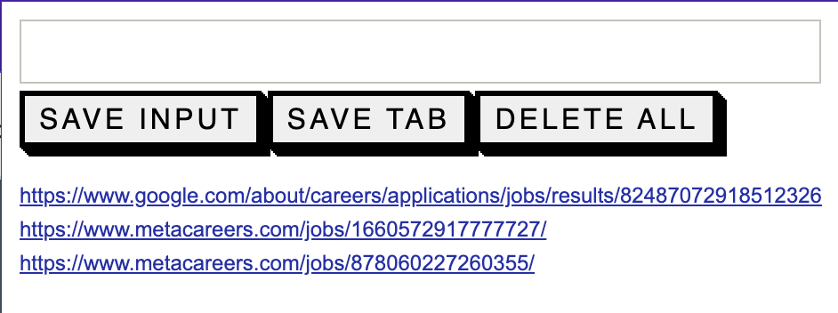

# JobList Chrome Extension

## About

JobList is a personal Chrome extension designed to help job seekers streamline their job application process. With just a single click, you can save the job listings from any job portal into the extension's local storage. This allows you to revisit and apply to these jobs at your convenience, without the fear of losing them when the browser is closed or reopened.

## Features

- **Easy Saving:** Save job links with a single click from any job portal.
- **Persistent Storage:** Uses Chrome's local storage to keep your job links safe even when the browser is restarted.
- **Manage Jobs:** View, apply, or delete saved job links directly from the extension.

## Screenshot

## Installation

1. Download the extension package.
2. Open the Chrome browser and navigate to `chrome://extensions/`.
3. Enable Developer Mode by toggling the switch in the upper-right corner.
4. Click the "Load unpacked" button and select the extension package folder.
5. The JobList extension should now be installed on your Chrome browser.

## Usage

To save a job link:
1. Navigate to the job listing on any job portal.
2. Click on the JobList Chrome extension icon.
3. The job link is automatically saved to your list.

To view your saved job links:
1. Click on the JobList Chrome extension icon.
2. A list of saved jobs will be displayed.
3. Click on a link to navigate to the job listing or use the delete option to remove it from the list.

## Author

Harisahan N. Venkata

## Support

For support, email: harisahan@gmail.com or raise an issue on the GitHub project page.

